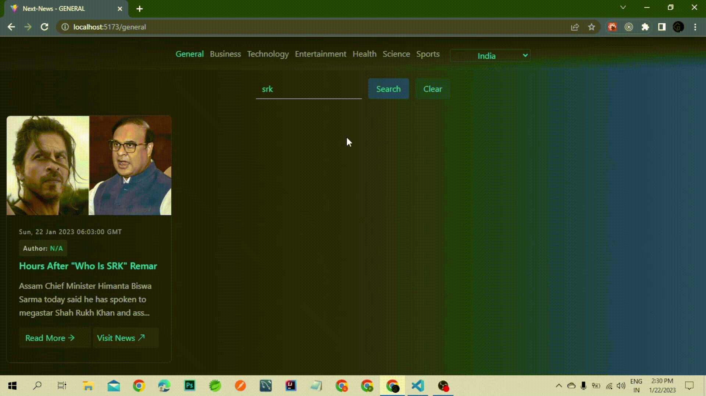

## ***NewsApp [React News web app]***

Hi there I am Gautam. I'm a web developer.

The Next News created using React and News API is a powerful tool that allows users to stay informed on the latest news and events from around the world. With a sleek and user-friendly interface, the webapp provides a seamless browsing experience, making it easy for users to find the information they need quickly and efficiently.

Using the News API, the webapp is able to aggregate news articles from a wide variety of sources, providing users with access to the latest breaking news, as well as in-depth coverage of a wide range of topics, from politics and business to sports and entertainment. Users can easily search for news stories based on their interests.

Built using React, the webapp is optimized for performance and responsiveness, ensuring that it loads quickly and works seamlessly across a wide range of devices, from desktop computers to mobile phones and tablets. Whether you're looking to stay up-to-date on current events or simply want to explore the latest news from around the world, this webapp provides a powerful and intuitive platform for accessing the latest news and information.

<br/>

## project Overview
 <br />


 <br />

### Searching filter

<br/>



---

If you want to run this in your system follow these steps :-

***step1.*** clone Project

```
git clone https://github.com/Gautamvaishnav-git/NewsApp-FC-.git
```

***step2.*** Open Project in your code Editor and open terminal and paste the following command

```
npm i
```
***step3.*** In the terminal run the following command

```
npm run dev
```

***step4.*** Visit this address

[localhost://5173](http://localhost:5173/)

